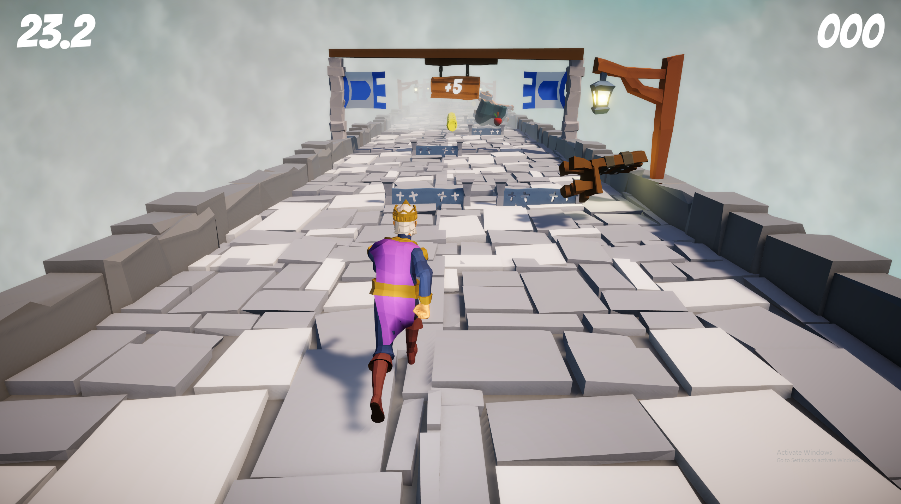
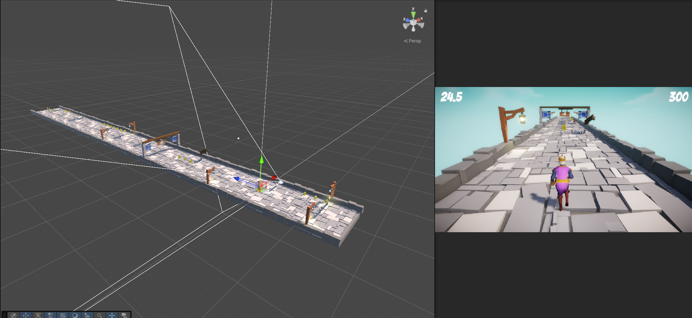

# Infinite Runner 3D
Procedurally generated infinite level 3D Runner Game.
All the obstacles and objects on the map are generated automatically and randomly. The game has a difficulty progression 
after each passed checkpoint the amount of dropped objects increases.

## Screenshots

## To Play the Game 
- Use WASD for MOVEMENT
- Use ESC key for EXIT

## How to Play?
- Download the Project
- Open and Unzip the Folder Named "Windows Build".
- Click on Infinite_Runner_3D.exe.

## Tools used while developing this project
- Unity.
- Visual Studio Code.
- Coding in C# Programming Language.
- GitBash.
  
## Contacts 
- E-mail address orkhan.elchuev@gmail.com
- https://github.com/OrkhanElchuev/Spookland
  
## Acknowledgements
- Level Assets - [GDTV Assets](https://gamedev.tv/products?page=1&types=AssetPack)
- Skybox - [Fantasy Skybox](https://assetstore.unity.com/publishers/4162)
- Player Animation - [Mixamo](https://www.mixamo.com/#/)
- Background Music - [Opengameart](https://opengameart.org/content/battle-theme-a)
